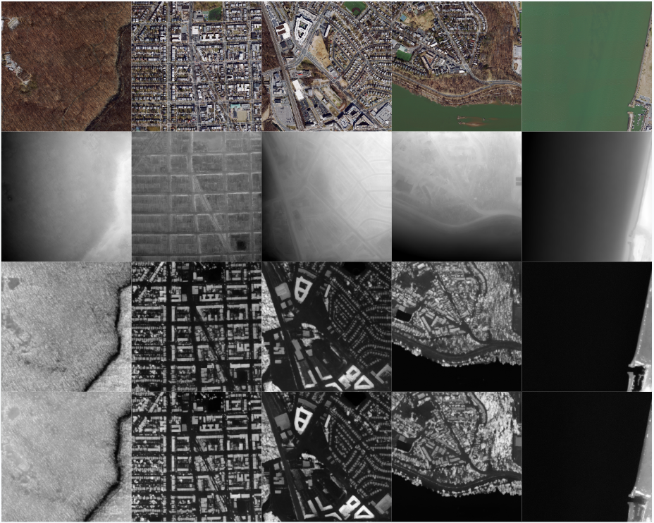

# Digital Surface Model (DSM) Generation Using Conditional Diffusion.
 
**Utilizing Marigold* depth generation model to generate DSM from monocular orthorectified image
 * = Marigold: Repurposing Diffusion-Based Image Generators for Monocular Depth Estimation (https://marigoldmonodepth.github.io)

